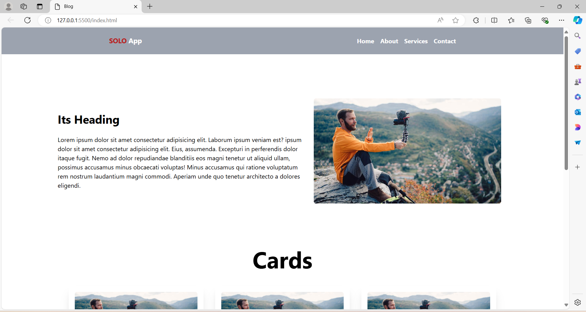
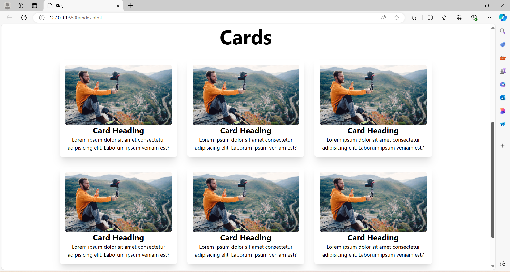

# Blog Project

A blog project developed during a [Udemy course](https://www.udemy.com/share/10aCfs3@G08F29ltQr9YhVVqXXuC5hnQkxQLAayz1akjOtP5iQVqTFvR2Vg2m2IdVZsC2ANV/) by Vapa Academy, built using HTML, and Tailwind CSS.

## Table of Contents

- [Screenshots](#screenshots)
- [Installation](#installation)
- [Usage](#usage)
- [Features](#features)
- [Technologies Used](#technologies-used)
- [Contributing](#contributing)
- [Credits](#credits)
- [License](#license)

## Screenshots





## Installation

To set up this project locally, follow these steps:
1. Clone the repository:
  ```
   git clone https://github.com/anandyelloju/udemy-blog-vapaacademy.git
  ```
2. Navigate to the project directory:
  ```
   cd udemy-blog-vapaacademy
  ``` 
3. Open the `index.html` file in your web browser to view the blog.

## Usage

After installation, you can view and edit the blog directly in your web browser. The blog includes several sections:

- **Home:** Displays recent blog posts.
- **Post Page:** Detailed view of individual blog posts.
- **Archive:** Lists all blog posts by date.
- **Contact:** Form for visitors to reach out.

**Example:** Adding a New Blog Post\
To add a new blog post, update the `index.html` file and create a new HTML file for the post:

```html
<div class="post-card">
  
  <div class="post-info">
    <h3>Blog Post Title</h3>
    <p>A short description of the blog post content.</p>
    <a href="post1.html" target="_blank" class="post-link">Read More</a>
  </div>
</div>
```
<!--
## Features

- **Blog Post Management:** Easily add, edit, and delete blog posts.
- **Responsive Design:** The blog is fully responsive and works on all devices.

## Technologies Used

- **HTML:** Markup language for creating web pages.
- **Tailwind CSS:** Utility-first CSS framework for styling.

[](https://skillicons.dev)

## Contributing

Contributions are always welcome! - If you have suggestions or improvements.

## Credits

[Vapa Academy](https://www.udemy.com/user/mst-shobnom-mosthary/): Instructor of the Udemy course.

## License

This project is licensed under the [MIT License](https://choosealicense.com/licenses/mit/) - see the [LICENSE](https://github.com/anandyelloju/udemy-blog-vapaacademy/blob/main/LICENSE) file for details.
-->
